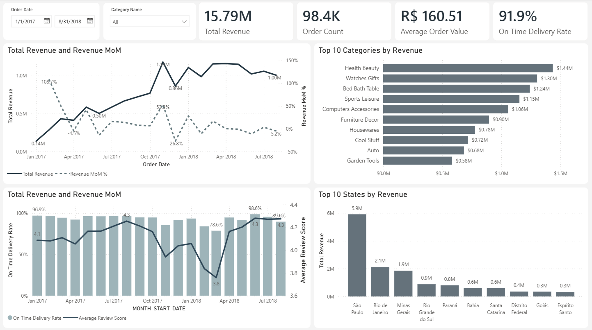
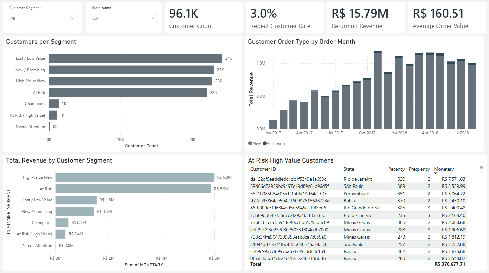
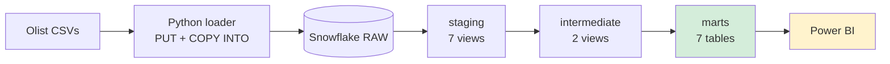
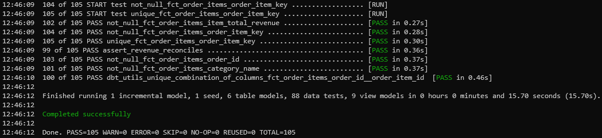
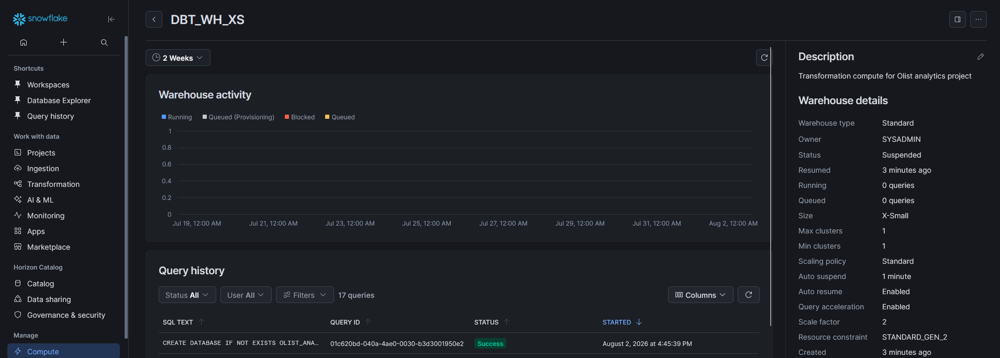
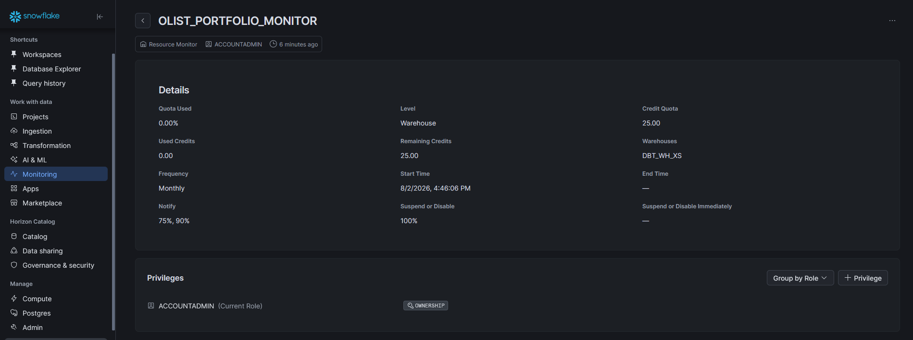
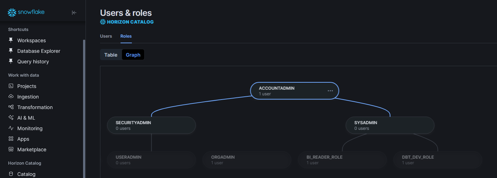
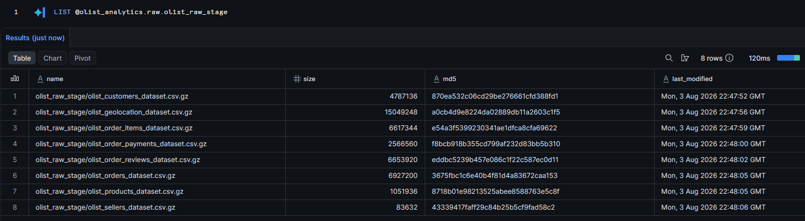
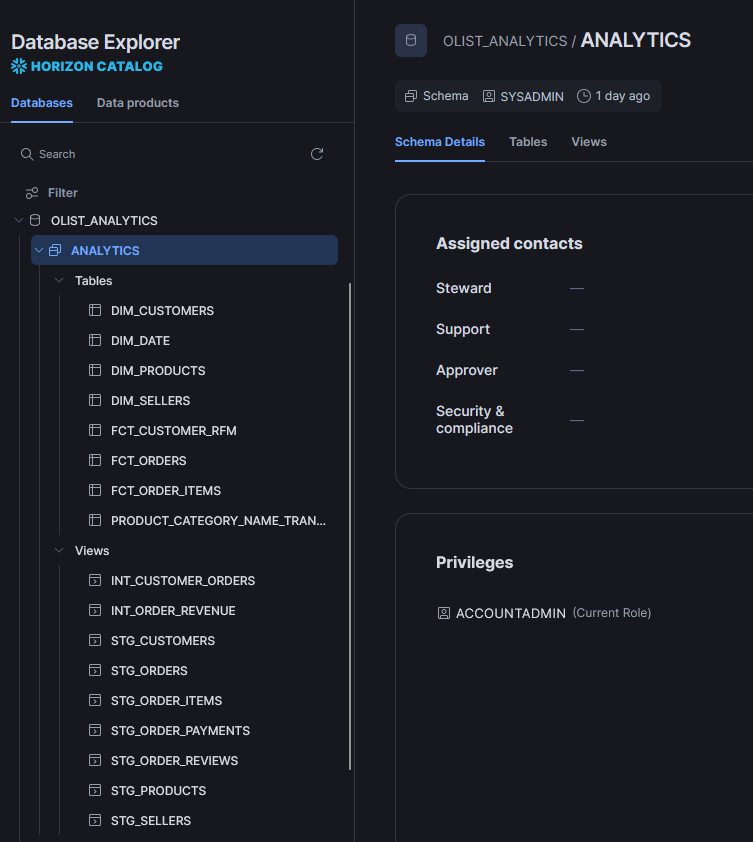
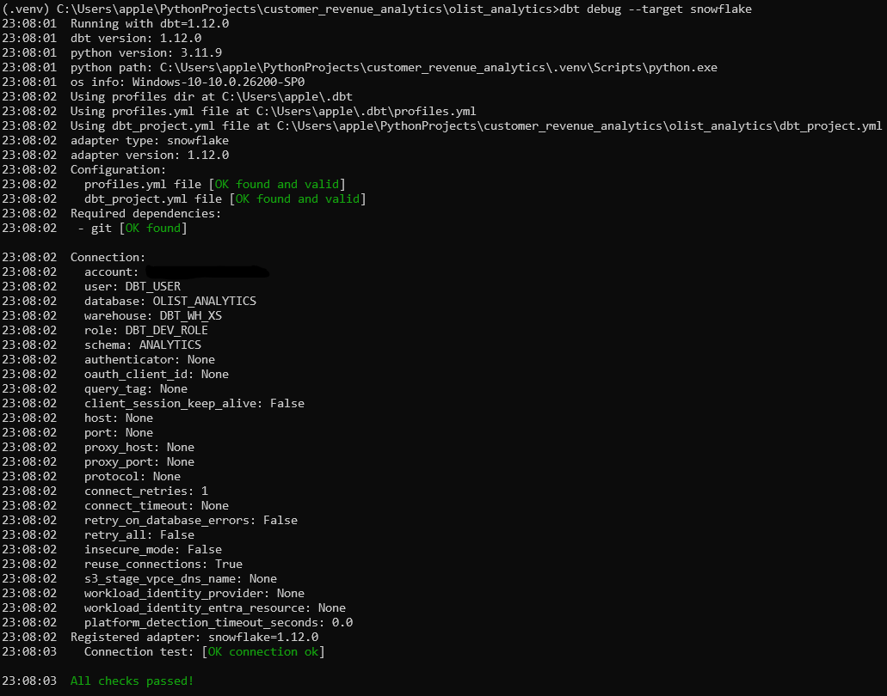

# Customer Revenue & Retention Analytics Platform
 
A governed analytics platform modeling ~100k Brazilian e-commerce orders into a tested 
dimensional warehouse, deployed to Snowflake with role-based access control, and surfaced 
through a Power BI executive dashboard.
 
**Stack:** dbt Core | Snowflake | Power BI | Python | SQL

**Data:** [Olist Brazilian E-Commerce Public Dataset](https://www.kaggle.com/datasets/olistbr/brazilian-ecommerce) (Kaggle, ~100k real anonymized orders, 2016–2018)

---



 
## Problem
 
A marketplace's transactional history was spread across nine unrelated CSV extracts with 
no shared definition of revenue, no consistent customer identifier, and no documented 
treatment of canceled orders. Leadership couldn't get a straight answer to basic 
questions (total revenue, who the valuable customers are, whether delivery performance 
matters) without an analyst manually joining files, and different analysts produced 
different numbers from the same data.

### Questions Answered
| Area       | Question                                                                    |
|------------|-----------------------------------------------------------------------------|
| Revenue    | What is total revenue, and how is it trending month over month?             |
| Revenue    | Which product categories and regions drive revenue?                         |
| Retention  | What share of revenue comes from new versus returning customers?            |
| Retention  | Which customers are high-value, and which high-value customers are lapsing? |
| Operations | Are we delivering on time, and does late delivery damage satisfaction?      |

## Findings
 
|                                        |                               |
|----------------------------------------|-------------------------------|
| Total revenue                          | R$15.8M                       |
| Distinct customers                     | 96,096                        |
| Customers with exactly one order       | 95.8%                         |
| Revenue held by top two RFM segments   | 74.8%                         |
| High-value customers currently lapsing | 1,132 (R$378K lifetime value) |
| On-time delivery rate                  | 91.9%                         |
 
The single-purchase rate indicates this is an acquisition  rather than retention, 
and segmentation logic built around repeat-purchase frequency has to account for that.

## What was built
 
A single governed data model that resolves every downstream question to one number, 
deployed end to end:
 
- **16 dbt models**: staging, intermediate, and marts layers modeling orders, customers, 
products, and revenue into a tested star schema
- **99 automated tests**: including cross-layer reconciliation controls that catch join 
fan-out and silent row loss before they reach a dashboard
- **Full Snowflake deployment**: raw data loaded via stage and `COPY INTO`, role-based 
access control, key-pair authentication
- **RFM customer segmentation**: identifying 1,132 high-value customers worth R$378K 
in lifetime value who are actively lapsing
- **Two-page Power BI dashboard**: built on the governed warehouse, not on raw exports

## How it was built
 


### Tech Stack 
| Layer           | Tool                                                              | Purpose                                     |
|-----------------|-------------------------------------------------------------------|---------------------------------------------|
| Transformation  | dbt Core 1.12                                                     | Modeling, testing, documentation, lineage   |
| Local warehouse | DuckDB                                                            | Development target                          |
| Cloud warehouse | Snowflake (AWS, Enterprise)                                       | Production target                           |
| Ingestion       | Python (pandas, duckdb, snowflake-connector-python, cryptography) | Raw CSV loading, RSA key generation         |
| Testing         | dbt generic tests, dbt_utils, singular SQL tests                  | Data quality and reconciliation controls    |
| Visualization   | Power BI Desktop                                                  | Executive dashboard                         |
| Version control | Git / GitHub                                                      | Source control for all transformation logic |

**dbt Core** does the transformation, layered so each stage has one job: 
- Staging renames and casts with no business logic
- Intermediate holds reusable calculations (like revenue, computed once and consumed by 
three downstream models)
- Marts are what gets queried

The same dbt project runs against a local DuckDB target for fast free 
iteration and against Snowflake for production, switched with one flag.
 
**Snowflake** hosts the production warehouse
- Raw CSVs load through an internal stage with `PUT` and `COPY INTO` rather than pandas, 
and `INFER_SCHEMA` builds the table directly from the file, without handwritten schema 
to drift from the source.
- Access is split across three roles: a service account with full rights to 
build the warehouse, a separate read-only account for BI that has zero visibility 
into raw data, and an admin account used by neither tool.
 
**Power BI** is used for visualization
- Connects to the warehouse in Import mode against governed marts only, 
never staging, never raw.
- Page one covers revenue and delivery operations. 
- Page two covers customer segmentation and ends in a drillable, ranked list of at-risk customers, 
not just a chart.
 
**Python** handles ingestion: 
- A DuckDB loader for local development
- Snowflake loader using the connector library with key-pair authentication, and an RSA 
key generation script.
 
## Decisions
 
- **Customer identity was unclear in the source:** The raw data's `customer_id` is a 
per-order key, unique to every single order. Grouping by it makes every customer look 
like a one-time buyer and breaks retention analysis. Staging redefines 
`customer_id` to mean the actual person, applied consistently everywhere.
- **Revenue comes from one place only:** `order_items`, never joined against 
`order_payments`, which carries multiple rows per order for installment plans and 
would inflate revenue through fan-out. A reconciliation test checks the two grains 
agree on every build.
- **RFM segmentation uses thresholds:** ~96% of customers 
ordered exactly once, so quartile-based frequency scoring would slice one giant tie 
group into four meaningless buckets. Recognizing that a standard technique doesn't fit 
the data mattered more than applying it uniformly.
- **The reporting period is scoped intentionally:** The extract's first and last months 
are collection artifacts. November 2016 has zero orders which produced a 699K% 
month-over-month spike against a near-zero denominator. Trend analysis is scoped to 20 
complete months, retaining 99.6% of revenue.
- **Two bugs surfaced only on Snowflake:** Schema inference preserved 
lowercase CSV headers as case-sensitive identifiers, breaking every model until fixed at 
the ingestion layer. Also, Snowflake's `TRY_CAST` rejects non-string input where 
DuckDB's does not. Both were fixed at the layer that caused them.

## dbt Build
### Data quality and testing
Generic tests:
 
- **Uniqueness and not-null** on every primary key across all three layers
- **Composite key uniqueness** via `dbt_utils.unique_combination_of_columns` where the grain is multi-column
- **Referential integrity** via `relationships` tests between facts and dimensions
- **Accepted values** on every categorical field, including order status, payment type, RFM scores, and customer segment
- **Range validation** via `dbt_utils.accepted_range` on review scores

### Build result
```
Done. PASS=102  WARN=0  ERROR=0  SKIP=0  TOTAL=102
```
 


## Snowflake deployment
### Infrastructure
 
| Object                     | Configuration                                           | Rationale                                         |
|----------------------------|---------------------------------------------------------|---------------------------------------------------|
| Warehouse `DBT_WH_XS`      | X-Small, 60s auto-suspend, auto-resume                  | Auto shut off controls spend                      |                     |
| Database `OLIST_ANALYTICS` | Schemas `RAW` and `ANALYTICS`                           | Separates landed source data from governed output |
| Resource monitor           | 25 credit quota, notify at 75% and 90%, suspend at 100% | Hard spend cap set before any load ran            |
 

 


### Role-based access control
 
Three roles separating three concerns:
 
| Role             | Scope                                                     | Used by                         |
|------------------|-----------------------------------------------------------|---------------------------------|
| `DBT_DEV_ROLE`   | Full control of `OLIST_ANALYTICS`                         | dbt service account             |
| `BI_READER_ROLE` | `SELECT` on the `ANALYTICS` schema only. No `RAW` access. | Power BI                        |
| `ACCOUNTADMIN`   | Administration                                            | Human operator, used by no tool |
 
`DBT_USER` is created as `TYPE = SERVICE` with key-pair authentication, replacing password 
authentication which Snowflake has deprecated for service accounts. A service user cannot sign into Snowsight, so interactive access and programmatic access are structurally separated.
 


### Ingestion
 
Raw data is loaded with Snowflake's canonical bulk pattern rather than a Python convenience wrapper:
 
1. `CREATE FILE FORMAT` with `PARSE_HEADER = TRUE`
2. `CREATE STAGE` (internal named stage)
3. `PUT` with `AUTO_COMPRESS` to upload and gzip in one step
4. `CREATE TABLE USING TEMPLATE` from `INFER_SCHEMA`, so no handwritten schema can drift from the source
5. `COPY INTO` with `MATCH_BY_COLUMN_NAME = CASE_INSENSITIVE` and `ON_ERROR = ABORT_STATEMENT`
Schema inference produces correctly typed columns (`TIMESTAMP_NTZ`, `NUMBER`) rather than the VARCHAR-everything a pandas load would give.
 

 

### Connection
 

 
Credentials are supplied through environment variables referenced by `env_var()` in 
`profiles.yml`. No secret is committed. The RSA private key is gitignored and never 
leaves the local machine.

## Power BI Dashboard
### Page 1: Revenue and Operations
 

 
Monthly revenue trend, revenue by product category, revenue by state, and the relationship between on-time delivery and review score. Built on `fct_order_items` at item grain so a category slicer filters every visual on the page consistently, with `DISTINCTCOUNT(order_id)` guarding order-level measures against multi-item inflation.
 
### Page 2: Customer Segmentation and Retention
 

 
RFM segment distribution, revenue contribution by segment, the new versus returning revenue split over time, and a drillable list of At Risk (High Value) customers ranked by lifetime value.
 
Includes a named, exportable, prioritized list of high-value customers who are lapsing.

### Semantic model
 
| From                         | To                                | Cardinality |
|------------------------------|-----------------------------------|-------------|
| `dim_date[date_key]`         | `fct_orders[order_date_key]`      | 1 to many   |
| `dim_date[date_key]`         | `fct_order_items[order_date_key]` | 1 to many   |
| `dim_customers[customer_id]` | `fct_orders[customer_id]`         | 1 to many   |
| `dim_customers[customer_id]` | `fct_customer_rfm[customer_id]`   | 1 to 1      |
| `dim_products[product_id]`   | `fct_order_items[product_id]`     | 1 to many   |
 
`dim_date` is marked as a date table. 
Measures live in a dedicated `_Measures` table rather than scattered across fact tables.

## Run

```cmd
git clone https://github.com/jon-appleby/customer_revenue_analytics.git
cd customer_revenue_analytics
python -m venv .venv && .venv\Scripts\activate
pip install -r requirements.txt
 
kaggle datasets download -d olistbr/brazilian-ecommerce -p data/raw --unzip
python scripts/load_to_duckdb.py
 
cd olist_analytics
dbt deps
dbt build
dbt docs serve
```

Snowflake deployment requires a trial or paid account: 
run `docs/resources/snowflake_setup.sql`, generate a key pair 
with `scripts/generate_snowflake_keys.py`, set 
`SNOWFLAKE_ACCOUNT` / `SNOWFLAKE_USER` / `SNOWFLAKE_PRIVATE_KEY_PATH`, 
then `dbt build --target snowflake`.

## Potential future enhancements
- **Orchestration**: Dagster or Airflow to schedule ingestion and `dbt build`
- **Incremental materialization**: Instead of a full rebuild, in production the data would move 
to an incremental merge strategy
- **Freshness monitoring**: Add checks for freshness in dbt, so stale data is caught

---

_Built on public, anonymized data. No proprietary or client data appears in this repository._